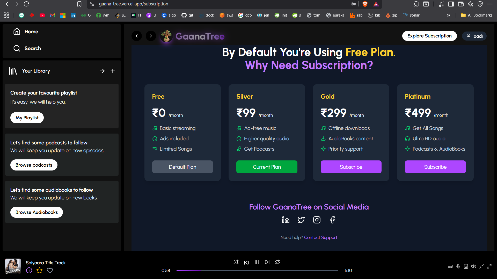
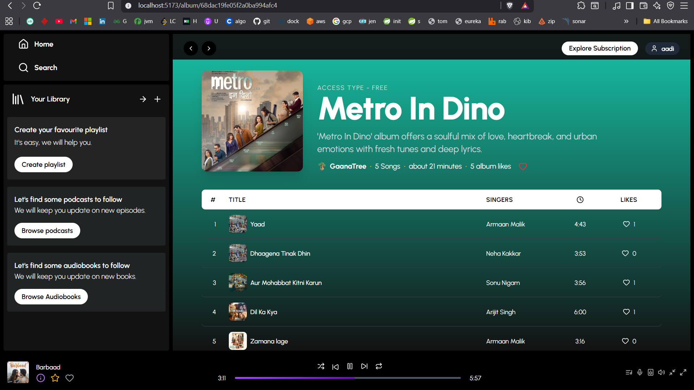
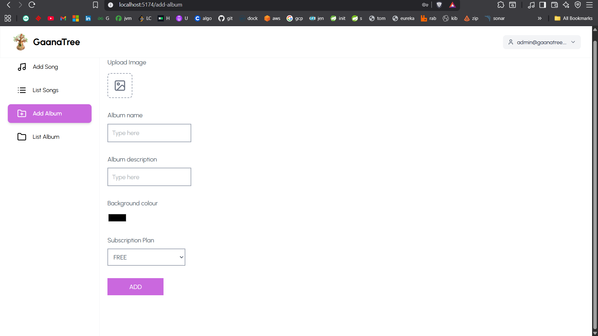
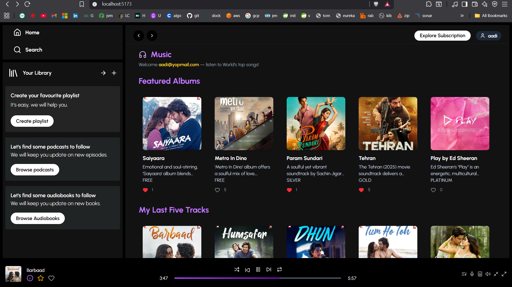
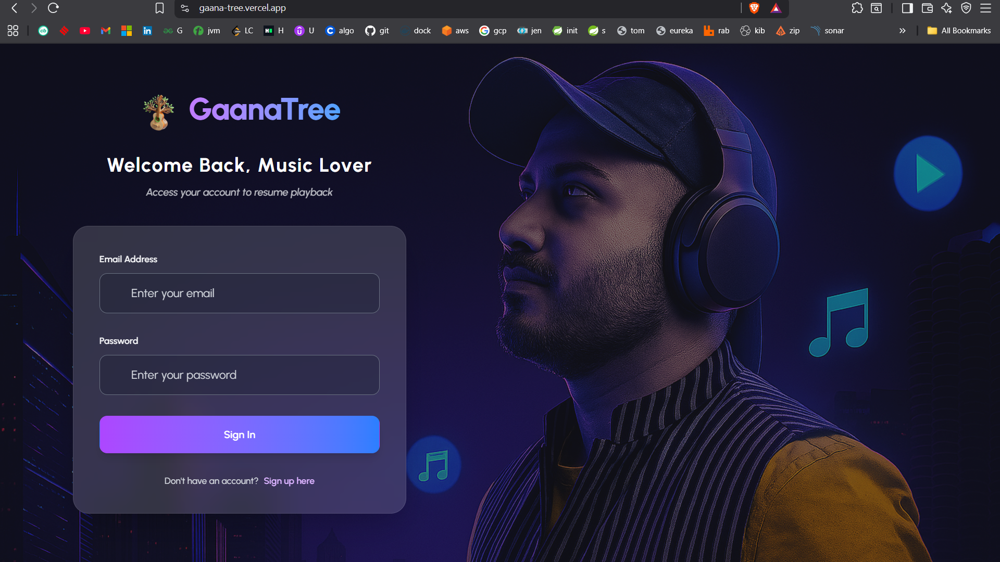

# 🎵 GaanaTree – Music, Podcasts & Audiobooks Platform
GaanaTree is a modern **React-based music streaming web app** that allows users to explore songs,
albums, podcasts, and audiobooks. It supports **subscription plans**, user authentication, likes, 
playlists, comment and a clean responsive UI. This is frontend repository for gaana-tree-admin.


## Pending Task
- Add Songs to favourite list (create one default favourite folder, can't be deleted). 
  In case user want to create folder and add songs, let him do that.
- Implements songs by singer
- Google OAuth2 login, email OTP verification during account creation, forgot/reset password, user profile image
- Implement Podcast
- Implement Audiobooks (can use AI to convert readable books)
- Implement Subscription with payment and expiry
- Push code to Live (Dockerized Backend at Render and Frontend at Vercel)

## ✨ Features
* 🎶 **Songs & Albums** – Browse songs, albums, playlists with track images & metadata.
* 🎙️ **Podcasts & Audiobooks** – Explore curated podcasts & audiobook collections.
* ❤️ **Likes System** – Like/unlike songs & albums with live counters. Also have comment section for songs.
* 🎧 **Player Context** – Centralized music player across pages.
* 📱 **Responsive UI** – Mobile-first design using Tailwind CSS.
* 🔐 **Authentication** – User login & subscription handling via AuthContext.
* 💳 **Subscription Plans** – Free, Silver, Gold, and Platinum tiers with premium features.
* ☁️ **API Ready** – Modular API services for albums, songs, and subscriptions.

## 🛠️ Tech Stack
* **Frontend**: [React](https://react.dev/), [React Router](https://reactrouter.com/), [Tailwind CSS](https://tailwindcss.com/), [Lucide Icons](https://lucide.dev/)
* **State Management**: React Context API (`AuthContext`, `PlayerContext`)
* **Backend APIs**: `albumsAPI`, `songsAPI`, `subscriptionAPI` (dummy/mock ready)
* **Notifications**: [react-hot-toast](https://react-hot-toast.com/)
* **Build Tool**: [Vite](https://vitejs.dev/)

## 📂 React Js Frontend Project Structure

```
gaana-tree/
│
├── public/              # Static assets (logo, images)
├── src/
│   ├── assets/          # Images & assets
│   ├── context/         # AuthContext, PlayerContext
│   ├── pages/           # ExploreSubscription, DisplayAlbum, PlaylistHome, etc.
│   ├── services/        # API service handlers
│   ├── App.jsx          # Main app routing
│   ├── main.jsx         # React entry point
│   ├── index.css        # TailwindCSS entry
│   └── components/      # Reusable UI components for songs
│        ├── audiobooks  # Reusable UI components for audiobooks
│        ├── podcasts    # Reusable UI components for podcast
│        └── favPlaylist # Reusable UI components for playlist
├── package.json
├── tailwind.config.js
├── vite.config.js
├── .env
└── README.md
```

---

```
gaana-tree-admin/
│
├── public/              # Static assets (logo, images)
├── src/
│   ├── assets/          # Images & assets
│   ├── components/      # ProtectedRoute
│   ├── context/         # AuthContext
│   ├── layout/          # DashboardLayout, Navbar, Sidebar
│   ├── pages/           # AddAlbum, AddSong, ListSong, ListAlbum, AdminProfile, Login
│   ├── services/        # API service handlers [apiService.js]
│   ├── App.jsx          # Main app routing
│   ├── main.jsx         # React entry point
│   └── index.css        # TailwindCSS entry
│
├── package.json
├── tailwind.config.js
├── vite.config.js
├── .env
└── README.md
```

---

## 📂 Spring-boot Backend Project Structure
```
gaana-tree-backend/
│
├── src/main/java/org/aadi/gaana_tree/
│   ├── config/                 # Configurations
│   │   ├── SecurityConfig.java # Spring Security + JWT
│   │   └── CloudinaryConfig.java
│   │
│   ├── controllers/            # REST Controllers (API endpoints)
│   │   ├── AuthController.java
│   │   ├── AlbumController.java
│   │   ├── SongController.java
│   │   ├── CommentController.java
│   │   ├── PodcastController.java
│   │   ├── AudiobookController.java
│   │   ├── SubscriptionController.java
│   │   └── UserController.java
│   │
│   ├── dto/                    # DTOs (request/response objects)
│   │   ├── AlbumRequest.java
│   │   ├── RegisterRequest.java
│   │   ├── AuthRequest.java
│   │   ├── AuthResponse.java
│   │   ├── CommentRequest.java
│   │   ├── AlbumListResponse.java
│   │   ├── SongRequest.java
│   │   ├── UserResponse.java
│   │   └── SongListResponse.java
│   │
│   ├── document/               # JPA Entities (tables)
│   │   ├── User.java
│   │   ├── Album.java
│   │   ├── Song.java
│   │   ├── Comment.java
│   │   ├── Podcast.java
│   │   ├── Audiobook.java
│   │   └── SubscriptionPlan.java # Enum
│   │
│   ├── repositories/           # Spring Data JPA Repositories
│   │   ├── UserRepository.java
│   │   ├── AlbumRepository.java
│   │   ├── SongRepository.java
│   │   ├── PodcastRepository.java
│   │   ├── AudiobookRepository.java
│   │   └── CommentRepository.java
│   │
│   ├── security/               # JWT utils & filters
│   │   └── JwtAuthenticationFilter.java
│   │
│   ├── services/               # Business logic
│   │   ├── AppUserDetailsService.java
│   │   ├── AlbumService.java
│   │   ├── SongService.java
│   │   ├── CommentService.java
│   │   ├── UserService.java
│   │   ├── PodcastService.java
│   │   ├── AudiobookService.java
│   │   └── DataInitializationService.java
│   │
│   ├── utils/                  # Helpers
│   │   └── JwtUtil.java
│   │
│   └── GaanaTreeBackendApplication.java # Main entry point
│
├── src/main/resources/
│   └── application.properties
│
├── Dockerfile
├── .env
├── .gitignore
├── pom.xml                     # Maven dependencies
└── README.md
```

## 🚀 Getting Started

### 1️⃣ Clone the Repository
```bash
git clone https://github.com/your-username/gaana-tree.git
cd gaana-tree
```

### 2️⃣ Install Dependencies

```bash
npm install
```

### 3️⃣ Build for Production

```bash
npm run build
npm run preview
```

### 4️⃣ Run the Development Server

```bash
npm run dev
```

## 🔑 Environment Variables
Create a `.env` file in root and configure as needed (example):

In Dev =>
```
VITE_API_BASE_URL=http://localhost:8080
```

In Production =>
```
VITE_API_BASE_URL=https://gaana-tree-backend.onrender.com
```

## 🧩 Available Pages
* `/` – Home page (Albums, Songs, Playlists)
* `/albums/:id` – Album details + tracks (`DisplayAlbum`)
* `/playlists` – Playlist Home (`PlaylistHome`)
* `/podcasts` – Podcast section
* `/audiobooks` – Audiobook section (`AudiobookHome`)
* `/subscription` – Explore Subscription Plans (`ExploreSubscription`)
* `/support` – Support & Help page (`Support`)
* `/song/:id` - for song details (`SongInfo`)
* `/search` - for search (`Search`)
* `/profile` - for user profile (`Profile`)
* `/settings` - for user specific gaana-tree app Settings (`Setting`)


## 💳 Subscription Plans
* **Free** – Basic streaming (ads, limited songs)
* **Silver (₹99/month)** – Ad-free, high-quality, podcasts
* **Gold (₹299/month)** – Offline downloads, audiobooks
* **Platinum (₹499/month)** – All features unlocked (Ultra HD audio, Podcasts & Audiobooks)

## 📸 Screenshots

### Subscription Plans


### Album Display


### Admin Panel Adding Album Display


### Home Page Display


### Login Page


## 🤝 Contributing
1. Fork the project
2. Create a feature branch: `git checkout -b feature/new-feature`
3. Commit changes: `git commit -m 'Add new feature'`
4. Push to branch: `git push origin feature/new-feature`
5. Open a Pull Request 

### App will be available at (Not yet deployed in Live Server):
In Dev => http://localhost:5173
Production => https://gaana-tree.vercel.app

### Admin panel will be available at:
In Dev => http://localhost:5174
Production => https://gaana-tree-admin.vercel.app

### Backend will be available at:
In Dev => http://localhost:8080
Production => https://gaana-tree-backend.onrender.com

## 📜 License
This project is licensed under the **MIT License**.